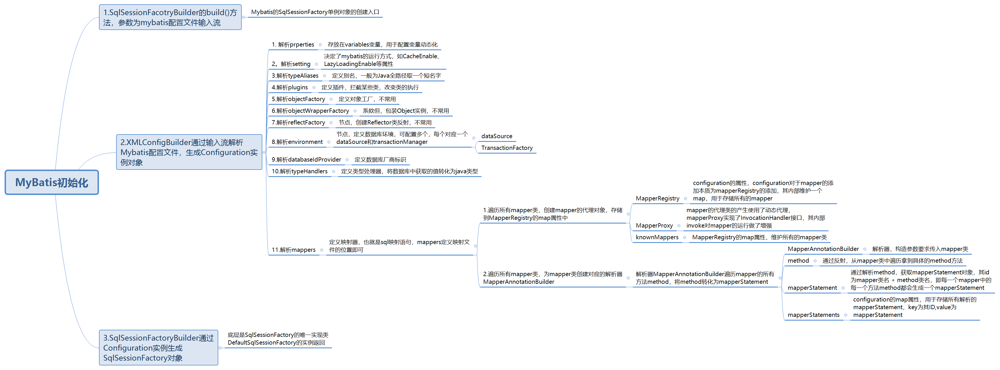
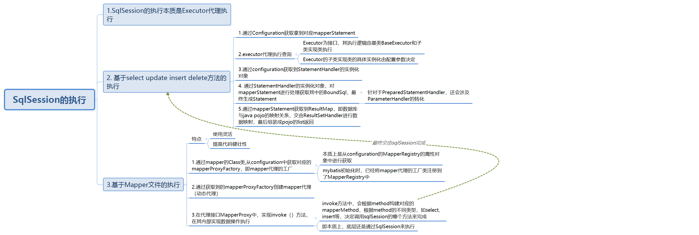

   
   
   
### MyBatis源码学习

####1. 架构原理


##### 1.1架构与层次结构图


####2.核心类

#####2.1. MyBatis配置文件
 
  - SqlMapConfig.xml 作为mybatis的全局配置文件，配置mybatis的运行环境
  - Mapper.xml mybatis的sql映射文件，需要在SqlMapConfig.xml中加载
    
#####2.2. SqlSessionFactory
    
  - 通过Mybatis配置文件构建会话工厂SqlSessionFactory
    
#####2.3. SqlSession 

   - 通过会话工厂创建的sqlSession即会话，通过sqlSession进行数据库的操作
    
#####2.4. Executor执行器

   - Mybatis运行的核心，调度器，调用mybatis三大组件的执行。
    
#####2.5. MappedStatement

   - Mybatis底层封装对象，包含mybatis配置信息和sql的映射信息，mapper.xml中一个delete标签对应一个Mapped Statement对象，标签的ID即是MappedStatement的id。
   - MappedStatement对sql执行输入参数定义，包括HashMap、基本类型和pojo，Executor通过MappedStatement在执行sql前将输入的java对象映射至sql中，输入参数映射就是jdbc编程中对preparedStatement设置参数
   - MappedStatement对sql执行输出结果定义，输出结果映射过程相当于jdbc编程中对结果的解析处理过程。

#### 3.源码解析

##### 3.1 SqlSessionFactory的创建

初始化Mybatis的过程，就是创建SqlSessionFactory单例的过程

1. mybatis读取全局xml配置文件，解析xml元素结点
2. 将xml结点值设置到configuration实例的相关变量中
3. 由configuration实例创建SqlSessionFactory实例

核心类

| 类名   | 作用   |
| ---- | ---- |
|  SqlSessionFactoryBuilder    | 用来创建SqlSessionFactory实例。链式创建模式     |
| XMLConfigBuilder| 1.解析XML文件，生成XNode对象</br> 2.创建并初始化Configuration实例。3.解析XNode的键值对，转换为属性设置到configuration实例中|
| Configuration| 数据类，包含mybatis所有配置信息，初始化最重要的内容就是创建并初始化该实例|
|SqlSessionFactory| 创建sqlSession实例的工厂类，一般当作单例使用，默认实现DefaultSessionFactory|

流程

```java
public class SqlSessionFactoryBuilder {
     public SqlSessionFactory build(InputStream inputStream, String environment, Properties properties) {
        try {
            //inputStream XML输入流
            //environment sqlSessionFactory的数据库环境
            //properties 动态常量
          XMLConfigBuilder parser = new XMLConfigBuilder(inputStream, environment, properties);
          //构建configuration实例对象
          return build(parser.parse());
        } catch (Exception e) {
          throw ExceptionFactory.wrapException("Error building SqlSession.", e);
        } finally {
          ErrorContext.instance().reset();
          try {
            inputStream.close();
          } catch (IOException e) {
            // Intentionally ignore. Prefer previous error.
          }
        }
     }    
    
     public SqlSessionFactory build(Configuration config) {
       return new DefaultSqlSessionFactory(config);
     } 
}
```

```java
public class XMLConfigBuilder extends BaseBuilder {
    public XMLConfigBuilder(InputStream inputStream, String environment, Properties props) {
        //利用输入流生成XPathParser解析对象
        this(new XPathParser(inputStream, true, props, new XMLMapperEntityResolver()), environment, props);
      }
    
    private XMLConfigBuilder(XPathParser parser, String environment, Properties props) {
        super(new Configuration());
        ErrorContext.instance().resource("SQL Mapper Configuration");
        this.configuration.setVariables(props);
        this.parsed = false;
        this.environment = environment;
        this.parser = parser;
    }
    
    public Configuration parse() {
        if (parsed) {
          throw new BuilderException("Each XMLConfigBuilder can only be used once.");
        }
        parsed = true;
        parseConfiguration(parser.evalNode("/configuration"));
        return configuration;
    }
    
    private void parseConfiguration(XNode root) {
        try {
            //决定mybatis的运行方式，如CacheEnabled LazyLoadingEnabled等属性
          Properties settings = settingsAsPropertiess(root.evalNode("settings"));
          //issue #117 read properties first
          //用来配置变量动态化
            //datasource的username password等等
          propertiesElement(root.evalNode("properties"));
          loadCustomVfs(settings);
            //定义别名，为java全路径定义短名称
          typeAliasesElement(root.evalNode("typeAliases"));
          // 定义插件，用来拦截某些类，如：Executor， ParameterHandler, StatementHandler, ResultSetHandler
          pluginElement(root.evalNode("plugins"));
          objectFactoryElement(root.evalNode("objectFactory"));
          objectWrapperFactoryElement(root.evalNode("objectWrapperFactory"));
          reflectionFactoryElement(root.evalNode("reflectionFactory"));
          settingsElement(settings);
          // read it after objectFactory and objectWrapperFactory issue #631
          //定义数据库环境，可以配置多个，每个datasource对应一个transactionManager
          environmentsElement(root.evalNode("environments"));
          //定义数据库厂商标识，根据不同厂商执行不同sql语句
          databaseIdProviderElement(root.evalNode("databaseIdProvider"));
          //定义类型处理器，用来将数据库中获取的值转为Java类型
          typeHandlerElement(root.evalNode("typeHandlers"));
          //解析mappers 节点 映射器，也就是sql映射语句
          mapperElement(root.evalNode("mappers"));
        } catch (Exception e) {
          throw new BuilderException("Error parsing SQL Mapper Configuration. Cause: " + e, e);
        }
    }
}
```

###### 3.1.1 mapperElement

mappers定义了SQL语句映射关系

```java
public class XMLConfigBuilder extends BaseBuilder {
  private void mapperElement(XNode parent) throws Exception {
    if (parent != null) {
      for (XNode child : parent.getChildren()) {
        //子元素为package时将其下所有接口认为时mapper类，创建其类对象，加入到mapperRegistry中
        if ("package".equals(child.getName())) {
          String mapperPackage = child.getStringAttribute("name");
          configuration.addMappers(mapperPackage);
        } else {
          String resource = child.getStringAttribute("resource");
          String url = child.getStringAttribute("url");
          String mapperClass = child.getStringAttribute("class");
          if (resource != null && url == null && mapperClass == null) {
            //resource不为空时，加载对应的XML资源，并进行解析
            ErrorContext.instance().resource(resource);
            InputStream inputStream = Resources.getResourceAsStream(resource);
            XMLMapperBuilder mapperParser = new XMLMapperBuilder(inputStream, configuration, resource, configuration.getSqlFragments());
            mapperParser.parse();
          } else if (resource == null && url != null && mapperClass == null) {
              //url不为空时，加载对应的XML资源，并进行解析
            ErrorContext.instance().resource(url);
            InputStream inputStream = Resources.getUrlAsStream(url);
            XMLMapperBuilder mapperParser = new XMLMapperBuilder(inputStream, configuration, url, configuration.getSqlFragments());
            mapperParser.parse();
          } else if (resource == null && url == null && mapperClass != null) {
            Class<?> mapperInterface = Resources.classForName(mapperClass);
            configuration.addMapper(mapperInterface);
          } else {
            throw new BuilderException("A mapper element may only specify a url, resource or class, but not more than one.");
          }
        }
      }
    }
  }
}
```
采用代理模式，调用了MapperRegistry的addMappers方法

```java
public class XMLConfigBuilder extends BaseBuilder {
    
      public void addMappers(String packageName) {
        mapperRegistry.addMappers(packageName);
      }    
}

public class MapperRegistry {
      public void addMappers(String packageName) {
        addMappers(packageName, Object.class);
      }
        
       public void addMappers(String packageName, Class<?> superType) {
         ResolverUtil<Class<?>> resolverUtil = new ResolverUtil<Class<?>>();
         resolverUtil.find(new ResolverUtil.IsA(superType), packageName);
         Set<Class<? extends Class<?>>> mapperSet = resolverUtil.getClasses();
         for (Class<?> mapperClass : mapperSet) {
           addMapper(mapperClass);
         }
       }
    
      public <T> void addMapper(Class<T> type) {
        if (type.isInterface()) {
          if (hasMapper(type)) {
            throw new BindingException("Type " + type + " is already known to the MapperRegistry.");
          }
          boolean loadCompleted = false;
          try {
            //将新解析的mapper接口类添加到map中
            knownMappers.put(type, new MapperProxyFactory<T>(type));
            // It's important that the type is added before the parser is run
            // otherwise the binding may automatically be attempted by the
            // mapper parser. If the type is already known, it won't try.
            //解析mapper接口的各项注解，比如@Select等
            MapperAnnotationBuilder parser = new MapperAnnotationBuilder(config, type);
            parser.parse();
            loadCompleted = true;
          } finally {
            if (!loadCompleted) {
              knownMappers.remove(type);
            }
          }
        }
      }

}
```
knowsMappers是是一个HashMap类型, 其键值就是mapper接口的class对象，值为根据mapper接口的class对象为参数创建的MapperProxyFactory工厂类，
后续通过MapperRegistry获取mapper时，是通过其对应的mapper代理工厂MapperProxyFactory，获取mapper的代理对象。MapperProxy本质是一个代理接口InvocationHandler的实现类
```java
 private final Map<Class<?>, MapperProxyFactory<?>> knownMappers = new HashMap<Class<?>, MapperProxyFactory<?>>();

 public class MapperProxyFactory<T> {
 
   private final Class<T> mapperInterface;
   private final Map<Method, MapperMethod> methodCache = new ConcurrentHashMap<Method, MapperMethod>();
 
   public MapperProxyFactory(Class<T> mapperInterface) {
     this.mapperInterface = mapperInterface;
   }
 
   public Class<T> getMapperInterface() {
     return mapperInterface;
   }
 
   public Map<Method, MapperMethod> getMethodCache() {
     return methodCache;
   }
 
   @SuppressWarnings("unchecked")
   protected T newInstance(MapperProxy<T> mapperProxy) {
     return (T) Proxy.newProxyInstance(mapperInterface.getClassLoader(), new Class[] { mapperInterface }, mapperProxy);
   }
    
   //获取mapper本质是获取mapper的代理对象 mapperProxy只是增强接口的实现类
   public T newInstance(SqlSession sqlSession) {
     final MapperProxy<T> mapperProxy = new MapperProxy<T>(sqlSession, mapperInterface, methodCache);
     return newInstance(mapperProxy);
   }
 
 }

 public class MapperProxy<T> implements InvocationHandler, Serializable {
 
   private static final long serialVersionUID = -6424540398559729838L;
   private final SqlSession sqlSession;
   private final Class<T> mapperInterface;
   private final Map<Method, MapperMethod> methodCache;
 
   public MapperProxy(SqlSession sqlSession, Class<T> mapperInterface, Map<Method, MapperMethod> methodCache) {
     this.sqlSession = sqlSession;
     this.mapperInterface = mapperInterface;
     this.methodCache = methodCache;
   }
 
    //代理方法
   @Override
   public Object invoke(Object proxy, Method method, Object[] args) throws Throwable {
     if (Object.class.equals(method.getDeclaringClass())) {
       try {
         return method.invoke(this, args);
       } catch (Throwable t) {
         throw ExceptionUtil.unwrapThrowable(t);
       }
     }
     final MapperMethod mapperMethod = cachedMapperMethod(method);
     return mapperMethod.execute(sqlSession, args);
   }
 
   private MapperMethod cachedMapperMethod(Method method) {
     MapperMethod mapperMethod = methodCache.get(method);
     if (mapperMethod == null) {
       mapperMethod = new MapperMethod(mapperInterface, method, sqlSession.getConfiguration());
       methodCache.put(method, mapperMethod);
     }
     return mapperMethod;
   }
 
 }
```
与此同时在MapperRegistry的addMapper中，根据不同的mapper 的class创建对应的MapperAnnotationBuilder，通过parse解析，以及parseStatement方法的调用，将mapper中的对应的具体方法method解析，生成mappedStatement,即一个mapper类的一个方法对应一个mappedStatement,并将mappedStatement
加入到Configuration的对象的mappedStatements属性中，其结构为StrictMap，以mappedStatement的id为key，mappedStatement为value。其ID本质为mapper的类名+方法名，构成mappedStatement的唯一ID.
```java
public class MapperRegistry {
     public <T> void addMapper(Class<T> type) {
            if (type.isInterface()) {
              if (hasMapper(type)) {
                throw new BindingException("Type " + type + " is already known to the MapperRegistry.");
              }
              boolean loadCompleted = false;
              try {
                //将新解析的mapper接口类添加到map中
                knownMappers.put(type, new MapperProxyFactory<T>(type));
                // It's important that the type is added before the parser is run
                // otherwise the binding may automatically be attempted by the
                // mapper parser. If the type is already known, it won't try.
                //解析mapper接口的各项注解，比如@Select等,根据不同的mapper创建不同的MapperAnnotationBuilder
                MapperAnnotationBuilder parser = new MapperAnnotationBuilder(config, type);
                parser.parse();
                loadCompleted = true;
              } finally {
                if (!loadCompleted) {
                  knownMappers.remove(type);
                }
              }
            }
          }    
}

public class MapperAnnotationBuilder{
  public void parse() {
    String resource = type.toString();
    if (!configuration.isResourceLoaded(resource)) {
      loadXmlResource();
      configuration.addLoadedResource(resource);
      assistant.setCurrentNamespace(type.getName());
      parseCache();
      parseCacheRef();
      Method[] methods = type.getMethods();
      for (Method method : methods) {
        try {
          // issue #237
          if (!method.isBridge()) {
            //循环解析method
            parseStatement(method);
          }
        } catch (IncompleteElementException e) {
          configuration.addIncompleteMethod(new MethodResolver(this, method));
        }
      }
    }
    parsePendingMethods();
  }
    
  void parseStatement(Method method) {
      Class<?> parameterTypeClass = getParameterType(method);
      LanguageDriver languageDriver = getLanguageDriver(method);

        //sqlSource是mappedStatement的一个属性，用来提供BoundSQL对象
        //BoundSql用来建立sql语句，它包含sql String，入参parameterObject和入参映射parameterMappings。它利用sql语句和入参，组装成最终的访问数据库的SQL语句，包括动态SQL。这是mybatis Mapper映射的最核心的地方
      SqlSource sqlSource = getSqlSourceFromAnnotations(method, parameterTypeClass, languageDriver);
      if (sqlSource != null) {
        Options options = method.getAnnotation(Options.class);
        // 根据mapper的名称加上method的名称构成唯一id
        final String mappedStatementId = type.getName() + "." + method.getName();
        Integer fetchSize = null;
        Integer timeout = null;
        StatementType statementType = StatementType.PREPARED;
        ResultSetType resultSetType = ResultSetType.FORWARD_ONLY;
        SqlCommandType sqlCommandType = getSqlCommandType(method);
        boolean isSelect = sqlCommandType == SqlCommandType.SELECT;
        boolean flushCache = !isSelect;
        boolean useCache = isSelect;
  
        KeyGenerator keyGenerator;
        String keyProperty = "id";
        String keyColumn = null;
        if (SqlCommandType.INSERT.equals(sqlCommandType) || SqlCommandType.UPDATE.equals(sqlCommandType)) {
          // first check for SelectKey annotation - that overrides everything else
          SelectKey selectKey = method.getAnnotation(SelectKey.class);
          if (selectKey != null) {
            keyGenerator = handleSelectKeyAnnotation(selectKey, mappedStatementId, getParameterType(method), languageDriver);
            keyProperty = selectKey.keyProperty();
          } else if (options == null) {
            keyGenerator = configuration.isUseGeneratedKeys() ? new Jdbc3KeyGenerator() : new NoKeyGenerator();
          } else {
            keyGenerator = options.useGeneratedKeys() ? new Jdbc3KeyGenerator() : new NoKeyGenerator();
            keyProperty = options.keyProperty();
            keyColumn = options.keyColumn();
          }
        } else {
          keyGenerator = new NoKeyGenerator();
        }
  
        if (options != null) {
          flushCache = options.flushCache();
          useCache = options.useCache();
          fetchSize = options.fetchSize() > -1 || options.fetchSize() == Integer.MIN_VALUE ? options.fetchSize() : null; //issue #348
          timeout = options.timeout() > -1 ? options.timeout() : null;
          statementType = options.statementType();
          resultSetType = options.resultSetType();
        }
  
        String resultMapId = null;
        ResultMap resultMapAnnotation = method.getAnnotation(ResultMap.class);
        if (resultMapAnnotation != null) {
          String[] resultMaps = resultMapAnnotation.value();
          StringBuilder sb = new StringBuilder();
          for (String resultMap : resultMaps) {
            if (sb.length() > 0) {
              sb.append(",");
            }
            sb.append(resultMap);
          }
          resultMapId = sb.toString();
        } else if (isSelect) {
          resultMapId = parseResultMap(method);
        }
        //通过代理模式，内部本质是configuration进行添加
        assistant.addMappedStatement(
            mappedStatementId,
            sqlSource,
            statementType,
            sqlCommandType,
            fetchSize,
            timeout,
            // ParameterMapID
            null,
            parameterTypeClass,
            resultMapId,
            getReturnType(method),
            resultSetType,
            flushCache,
            useCache,
            // TODO issue #577
            false,
            keyGenerator,
            keyProperty,
            keyColumn,
            // DatabaseID
            null,
            languageDriver,
            // ResultSets
            null);
      }
    }
}

public class MapperBuildAssistant{
     public MappedStatement addMappedStatement(
          String id,
          SqlSource sqlSource,
          StatementType statementType,
          SqlCommandType sqlCommandType,
          Integer fetchSize,
          Integer timeout,
          String parameterMap,
          Class<?> parameterType,
          String resultMap,
          Class<?> resultType,
          ResultSetType resultSetType,
          boolean flushCache,
          boolean useCache,
          boolean resultOrdered,
          KeyGenerator keyGenerator,
          String keyProperty,
          String keyColumn,
          String databaseId,
          LanguageDriver lang,
          String resultSets) {
    
        if (unresolvedCacheRef) {
          throw new IncompleteElementException("Cache-ref not yet resolved");
        }
    
        id = applyCurrentNamespace(id, false);
        boolean isSelect = sqlCommandType == SqlCommandType.SELECT;
    
        MappedStatement.Builder statementBuilder = new MappedStatement.Builder(configuration, id, sqlSource, sqlCommandType)
            .resource(resource)
            .fetchSize(fetchSize)
            .timeout(timeout)
            .statementType(statementType)
            .keyGenerator(keyGenerator)
            .keyProperty(keyProperty)
            .keyColumn(keyColumn)
            .databaseId(databaseId)
            .lang(lang)
            .resultOrdered(resultOrdered)
            .resulSets(resultSets)
            .resultMaps(getStatementResultMaps(resultMap, resultType, id))
            .resultSetType(resultSetType)
            .flushCacheRequired(valueOrDefault(flushCache, !isSelect))
            .useCache(valueOrDefault(useCache, isSelect))
            .cache(currentCache);
    
        ParameterMap statementParameterMap = getStatementParameterMap(parameterMap, parameterType, id);
        if (statementParameterMap != null) {
          statementBuilder.parameterMap(statementParameterMap);
        }   
        //创建mappedStatement，调用configuration方法，加入mappedStatements中
        MappedStatement statement = statementBuilder.build();
        configuration.addMappedStatement(statement);
        return statement; 
    
    }
}

public class Configuration{
    protected final Map<String, MappedStatement> mappedStatements = new StrictMap<MappedStatement>("Mapped Statements collection");

  public void addMappedStatement(MappedStatement ms) {
    //以ms的id为key，ms为Value
    mappedStatements.put(ms.getId(), ms);
  }
}
```
在最后XMLConfigBuilder完成解析配置后，生成Configuration对象实例，生成SqlSessionFactory的默认实现类DefaultSqlSessionFactory的实例返回
```java
public class SqlSessionFactoryBuilder{
  public SqlSessionFactory build(Configuration config) {
    return new DefaultSqlSessionFactory(config);
  }
}
```

至此 mybatis的初始化完毕！

###### 3.1.2 总结



##### 3.2 SqlSession的创建

   Mybatis运行阶段，每次运行都是通过SqlSession来执行，是作为运行的核心，其本身不是线程安全的，一般放在局部作用域中，用完close掉。
 
 以SqlSessionFactory的默认实现类DefaultSqlSessionFactory为例
 ```java
public class DefaultSqlSessionFactory implements SqlSessionFactory {
      @Override
      public SqlSession openSession() {
        return openSessionFromDataSource(configuration.getDefaultExecutorType(), null, false);
      }
    
      private SqlSession openSessionFromDataSource(ExecutorType execType, TransactionIsolationLevel level, boolean autoCommit) {
          Transaction tx = null;
          try {
            // 获取environment配置
            final Environment environment = configuration.getEnvironment();
            //通过environment配置构造事务工厂TransactionFactory
            final TransactionFactory transactionFactory = getTransactionFactoryFromEnvironment(environment);
            tx = transactionFactory.newTransaction(environment.getDataSource(), level, autoCommit);
            //根据事务和配置的Execute类型构造执行器Executor
            final Executor executor = configuration.newExecutor(tx, execType);
            //创建SqlSession的默认实现类DefaultSqlSession的实例对象
            return new DefaultSqlSession(configuration, executor, autoCommit);
          } catch (Exception e) {
            closeTransaction(tx); // may have fetched a connection so lets call close()
            throw ExceptionFactory.wrapException("Error opening session.  Cause: " + e, e);
          } finally {
            ErrorContext.instance().reset();
          }
        }

      private TransactionFactory getTransactionFactoryFromEnvironment(Environment environment) {
        // 环境配置中没有设定事务配置时，默认采用容器进行事务管理
         if (environment == null || environment.getTransactionFactory() == null) {
           return new ManagedTransactionFactory();
         }
         return environment.getTransactionFactory();
       }
}
```
sqlSession的创建本质是其默认实现类DefaultSqlSession的实例的创建，通过读取配置文件，获取对应的事务工厂，若没有设置，则默认采用容器的事务管理工厂。通过配置文件设置，创建对应的执行器Executor，最后创建sqlSession实例

###### 3.2.1 事务工厂的创建

Mybatis事务工厂接口TransactionFactory有两个实现类

- ManagedTransactionFactory 对应的事务为 ManagedTransaction 其事务交由容器进行管理，连接connection从datasource中获取，commit等方法没有操作，为空
- JdbcTransactionFactory 对应的事务为 JdbcTransaction 其事务交由数据库进行管理，连接connection从datasource中获取，commit等方法本质是由connection进行代理执行。
- SpringManagedTransactionFactory 对应事务为 SpringManagedTransaction，为Spring-mybatis。jar包中，非mybatis原生事务。

```java
public class JdbcTransactionFactory implements TransactionFactory {

  @Override
  public void setProperties(Properties props) {
  }

  @Override
  public Transaction newTransaction(Connection conn) {
    return new JdbcTransaction(conn);
  }

  @Override
  public Transaction newTransaction(DataSource ds, TransactionIsolationLevel level, boolean autoCommit) {
    return new JdbcTransaction(ds, level, autoCommit);
  }
}
```
###### 3.2.2 Executor的创建

Executor是mybatis运行的核心，sqlSession内部的执行基本通过调度器Executor进行执行，通过Executor来调度StatementHandler、ParameterHandler和ResultSetHandler，四者合称mybatis四大组件。
```java
public class Configuration{
     public Executor newExecutor(Transaction transaction, ExecutorType executorType) {
        executorType = executorType == null ? defaultExecutorType : executorType;
        executorType = executorType == null ? ExecutorType.SIMPLE : executorType;
        Executor executor;
        if (ExecutorType.BATCH == executorType) {
          executor = new BatchExecutor(this, transaction);
        } else if (ExecutorType.REUSE == executorType) {
          executor = new ReuseExecutor(this, transaction);
        } else {
          //默认为SimpleExecutor
          executor = new SimpleExecutor(this, transaction);
        }
        //如果开启了缓存，则为Executor添加缓存
        if (cacheEnabled) {
          executor = new CachingExecutor(executor);
        }
        //遍历所有插件，将executor进行赋予
        executor = (Executor) interceptorChain.pluginAll(executor);
        return executor;
      }    
}
```
Executor继承图如下：


###### 3.2.3 SqlSession实例的创建

SqlSession本身的 select update等方法的实现，内部是Executor作为代理执行
```java
public class DefaultSqlSession{
    
     @Override
      public void select(String statement, Object parameter, RowBounds rowBounds, ResultHandler handler) {
        try {
          MappedStatement ms = configuration.getMappedStatement(statement);
          executor.query(ms, wrapCollection(parameter), rowBounds, handler);
        } catch (Exception e) {
          throw ExceptionFactory.wrapException("Error querying database.  Cause: " + e, e);
        } finally {
          ErrorContext.instance().reset();
        }
      }
    
     @Override
      public <E> List<E> selectList(String statement, Object parameter, RowBounds rowBounds) {
        try {
          MappedStatement ms = configuration.getMappedStatement(statement);
          return executor.query(ms, wrapCollection(parameter), rowBounds, Executor.NO_RESULT_HANDLER);
        } catch (Exception e) {
          throw ExceptionFactory.wrapException("Error querying database.  Cause: " + e, e);
        } finally {
          ErrorContext.instance().reset();
        }
      }
      // {.................................................}  
}
```


###### 3.2.4 总结


##### 3.3.SqlSession的执行

###### 3.3.1 mybatis基于select update insert delete的方法查询

查询流程

sqlSession的执行方法，本质是executor进行代理执行
```java
public class DefaultSqlSession{
      @Override
        //parameter 为参数， RowBounds为逻辑分页
      public <E> List<E> selectList(String statement, Object parameter, RowBounds rowBounds) {
        try {
           //根据mappedStatementId获取对应的ms
          MappedStatement ms = configuration.getMappedStatement(statement);
          //由Executor代理进行执行
          return executor.query(ms, wrapCollection(parameter), rowBounds, Executor.NO_RESULT_HANDLER);
        } catch (Exception e) {
          throw ExceptionFactory.wrapException("Error querying database.  Cause: " + e, e);
        } finally {
          ErrorContext.instance().reset();
        }
      }    
}
```
```java
public class BaseExecutor{
      @Override
      public <E> List<E> query(MappedStatement ms, Object parameter, RowBounds rowBounds, ResultHandler resultHandler) throws SQLException {
        BoundSql boundSql = ms.getBoundSql(parameter);
        //创建cacheKey，用作缓存的Key
        CacheKey key = createCacheKey(ms, parameter, rowBounds, boundSql);
        return query(ms, parameter, rowBounds, resultHandler, key, boundSql);
     }    
    
      @Override
      public <E> List<E> query(MappedStatement ms, Object parameter, RowBounds rowBounds, ResultHandler resultHandler, CacheKey key, BoundSql boundSql) throws SQLException {
        ErrorContext.instance().resource(ms.getResource()).activity("executing a query").object(ms.getId());
        if (closed) {
          throw new ExecutorException("Executor was closed.");
        }
        //当前查询请求为0时，清空缓存，直接从数据库查询，避免脏数据
        //localCache和localOutPutParameterCache为BaseExecutor的成员，构成了mybatis的一级缓存，即基于sqlSession的缓存，默认开启
        if (queryStack == 0 && ms.isFlushCacheRequired()) {
          clearLocalCache();
        }
        List<E> list;
        try {
          //记录当前查询的并发
          queryStack++;
          list = resultHandler == null ? (List<E>) localCache.getObject(key) : null;
          if (list != null) {
            //缓存命中，从缓存中获取
            handleLocallyCachedOutputParameters(ms, key, parameter, boundSql);
          } else {
            //否则从数据库中查询
            list = queryFromDatabase(ms, parameter, rowBounds, resultHandler, key, boundSql);
          }
        } finally {
          queryStack--;
        }
        //当所有查询语句结束时，，从缓存中取出执行结果
        if (queryStack == 0) {
          for (DeferredLoad deferredLoad : deferredLoads) {
            //延迟加载从缓存中获取结果
            deferredLoad.load();
          }
          // issue #601
          deferredLoads.clear();
          if (configuration.getLocalCacheScope() == LocalCacheScope.STATEMENT) {
            // issue #482
            //statement级别的缓存，只缓存相同id的sql，当所有的查询和延迟加载结束后，清空缓存，节省内存空间
            clearLocalCache();
          }
        }
        return list;
      }
    
      private <E> List<E> queryFromDatabase(MappedStatement ms, Object parameter, RowBounds rowBounds, ResultHandler resultHandler, CacheKey key, BoundSql boundSql) throws SQLException {
        List<E> list;
        //利用占位符，先进行缓存占位
        localCache.putObject(key, EXECUTION_PLACEHOLDER);
        try {
        //开始查询数据库，该方法由子类实现，不同子类的实现方式不同
          list = doQuery(ms, parameter, rowBounds, resultHandler, boundSql);
        } finally {
          localCache.removeObject(key);
        }
        //查询结果放入缓存
        localCache.putObject(key, list);
        if (ms.getStatementType() == StatementType.CALLABLE) {
          localOutputParameterCache.putObject(key, parameter);
        }
        return list;
      }
}
```
```java
public class SimpleExecutor extends BaseExecutor {
      @Override
      public <E> List<E> doQuery(MappedStatement ms, Object parameter, RowBounds rowBounds, ResultHandler resultHandler, BoundSql boundSql) throws SQLException {
        Statement stmt = null;
        try {
          Configuration configuration = ms.getConfiguration();
          //构建实例，表面为代理类RoutingStatementHandler的构建，但其只是门面类。
          StatementHandler handler = configuration.newStatementHandler(wrapper, ms, parameter, rowBounds, resultHandler, boundSql);
        //对StatementHandler进行初始化  
        stmt = prepareStatement(handler, ms.getStatementLog());
          return handler.<E>query(stmt, resultHandler);
        } finally {
          closeStatement(stmt);
        }
      }    
    
    //对StatementHandler进行初始化
     private Statement prepareStatement(StatementHandler handler, Log statementLog) throws SQLException {
        Statement stmt;
        Connection connection = getConnection(statementLog);
        //这里本质是调用的是StatementHandler的父类BaseStatementHandler的方法
        stmt = handler.prepare(connection);
        //SimpleParameter不做处理，PreparedStatementHandler会进行预处理，并且涉及到ParameterHandler的使用
        handler.parameterize(stmt);
        return stmt;
      }
}

public class Configuration{
      public StatementHandler newStatementHandler(Executor executor, MappedStatement mappedStatement, Object parameterObject, RowBounds rowBounds, ResultHandler resultHandler, BoundSql boundSql) {
        StatementHandler statementHandler = new RoutingStatementHandler(executor, mappedStatement, parameterObject, rowBounds, resultHandler, boundSql);
        statementHandler = (StatementHandler) interceptorChain.pluginAll(statementHandler);
        return statementHandler;
      }
}

public class RoutingStatementHandler implements StatementHandler {
     private final StatementHandler delegate;
     //构建实际具体的StatementHandler
      public RoutingStatementHandler(Executor executor, MappedStatement ms, Object parameter, RowBounds rowBounds, ResultHandler resultHandler, BoundSql boundSql) {
    
        switch (ms.getStatementType()) {
          case STATEMENT:
            delegate = new SimpleStatementHandler(executor, ms, parameter, rowBounds, resultHandler, boundSql);
            break;
          case PREPARED:
            delegate = new PreparedStatementHandler(executor, ms, parameter, rowBounds, resultHandler, boundSql);
            break;
          case CALLABLE:
            delegate = new CallableStatementHandler(executor, ms, parameter, rowBounds, resultHandler, boundSql);
            break;
          default:
            throw new ExecutorException("Unknown statement type: " + ms.getStatementType());
        }
    
      }
    
        // 代理类方法的调用，本质是具体实现类的方法的调用
      @Override
      public int update(Statement statement) throws SQLException {
        return delegate.update(statement);
      }   
}

public abstract class BaseStatementHandler implements StatementHandler {
      @Override
      public Statement prepare(Connection connection) throws SQLException {
        ErrorContext.instance().sql(boundSql.getSql());
        Statement statement = null;
        try {
          //创建并初始化产生Statement，其由子类进行方法的实现
          statement = instantiateStatement(connection);
          //设置超时时间和fetchSize获取数据库的行数
          setStatementTimeout(statement);
          setFetchSize(statement);
          return statement;
        } catch (SQLException e) {
          closeStatement(statement);
          throw e;
        } catch (Exception e) {
          closeStatement(statement);
          throw new ExecutorException("Error preparing statement.  Cause: " + e, e);
        }
      }    
}

```
```java
public class SimpleStatementHandler extends BaseStatementHandler {
      @Override
      protected Statement instantiateStatement(Connection connection) throws SQLException {
        if (mappedStatement.getResultSetType() != null) {
        //通过connection创建Statement
          return connection.createStatement(mappedStatement.getResultSetType().getValue(), ResultSet.CONCUR_READ_ONLY);
        } else {
          return connection.createStatement();
        }
      }   
    
        @Override
        public <E> List<E> query(Statement statement, ResultHandler resultHandler) throws SQLException {
          String sql = boundSql.getSql();
         //最后本质的执行是通过JDBC的statement进行执行
          statement.execute(sql);
          //处理查询结果，并返回
          return resultSetHandler.<E>handleResultSets(statement);
        }
}
```


configuration实例化StatementHandler,创建的是RoutingStatementHandler，但其本质只是门面类，其构造方法内部通过参数判断，
创建了具体的StatementHandler子类实例，RoutingStatementHandler的方法的调用，本质上是具体实例化的StatementHandler的子类的调用。 

总的来说 SqlSession查询的流程就是executor代理进行执行，通过mappedStatement的id拿到对应mappedStatement，然后再拿到内部已经解析好的BoundSql，获取到最终的查询sql，
另外configuration通过mappedStatement创建对应的statementHandler实例，通过statementHandler再拿到对应的Statement，底层最终通过JDBC的statement执行sql完成数据查询。
当然期间还涉及缓存的流程，以及针对不同的StatemntHandler涉及不同的组件，比如ParameterHandler等。

 数据转换流程（ResultSetHandler）

数据库的查询结果已经通过JDBC的查询拿到为ResultSet，ResultSetHandler组件的作用就是将其转换为Java的POJO,其默认实现为DefaultResultSetHandler，允许用户通过配置进行插件覆盖。

```java
public class DefaultResultSetHandler{
      @Override
      public List<Object> handleResultSets(Statement stmt) throws SQLException {
        ErrorContext.instance().activity("handling results").object(mappedStatement.getId());
    
        final List<Object> multipleResults = new ArrayList<Object>();
    
        int resultSetCount = 0;
        //从JDBC数据库的Statement中取出结果ResultSet
        ResultSetWrapper rsw = getFirstResultSet(stmt);
        //resultMap定义了数据库列和java属性之间的映射关系，初始化mappedStatement时存储到其中
        List<ResultMap> resultMaps = mappedStatement.getResultMaps();
        int resultMapCount = resultMaps.size();
        validateResultMapsCount(rsw, resultMapCount);
        //遍历处理resultSet
        while (rsw != null && resultMapCount > resultSetCount) {
          //拿到resultMap
          ResultMap resultMap = resultMaps.get(resultSetCount);
          //将resultMap和resultSet结合，进行数据库到JAVA之间的映射
          handleResultSet(rsw, resultMap, multipleResults, null);
          //获取下一条resultSet
          rsw = getNextResultSet(stmt);
         //清空嵌套的Result结果集
          cleanUpAfterHandlingResultSet();
          resultSetCount++;
        }
    
        // 4 处理嵌套的resultMap，即映射结果中的某些子属性也需要resultMap映射时
        String[] resultSets = mappedStatement.getResulSets();
        if (resultSets != null) {
          while (rsw != null && resultSetCount < resultSets.length) {
            ResultMapping parentMapping = nextResultMaps.get(resultSets[resultSetCount]);
            if (parentMapping != null) {
              String nestedResultMapId = parentMapping.getNestedResultMapId();
              ResultMap resultMap = configuration.getResultMap(nestedResultMapId);
              handleResultSet(rsw, resultMap, null, parentMapping);
            }
            rsw = getNextResultSet(stmt);
            cleanUpAfterHandlingResultSet();
            resultSetCount++;
          }
        }
        //构造成list，将处理后的结果返回
        return collapseSingleResultList(multipleResults);
      }    

      private void handleResultSet(ResultSetWrapper rsw, ResultMap resultMap, List<Object> multipleResults, ResultMapping parentMapping) throws SQLException {
        try {
          if (parentMapping != null) {
            handleRowValues(rsw, resultMap, null, RowBounds.DEFAULT, parentMapping);
          } else {
            if (resultHandler == null) {
              DefaultResultHandler defaultResultHandler = new DefaultResultHandler(objectFactory);
              handleRowValues(rsw, resultMap, defaultResultHandler, rowBounds, null);
              multipleResults.add(defaultResultHandler.getResultList());
            } else {
              handleRowValues(rsw, resultMap, resultHandler, rowBounds, null);
            }
          }
        } finally {
          // issue #228 (close resultsets)
          closeResultSet(rsw.getResultSet());
        }
      }
}
```

关于结果映射处理这一块，在configuration构建StatementHandler时，通过StatementHandler的基类BaseStatementHandler的构造方法，完成了ResultSetHandler的初始化
```java
public abstract class BaseStatementHandler implements StatementHandler {
    protected BaseStatementHandler(Executor executor, MappedStatement mappedStatement, Object parameterObject, RowBounds rowBounds, ResultHandler resultHandler, BoundSql boundSql) {
        this.configuration = mappedStatement.getConfiguration();
        this.executor = executor;
        this.mappedStatement = mappedStatement;
        this.rowBounds = rowBounds;
    
        this.typeHandlerRegistry = configuration.getTypeHandlerRegistry();
        this.objectFactory = configuration.getObjectFactory();
    
        if (boundSql == null) { // issue #435, get the key before calculating the statement
          generateKeys(parameterObject);
          boundSql = mappedStatement.getBoundSql(parameterObject);
        }
    
        this.boundSql = boundSql;
    
        this.parameterHandler = configuration.newParameterHandler(mappedStatement, parameterObject, boundSql);
        this.resultSetHandler = configuration.newResultSetHandler(executor, mappedStatement, rowBounds, parameterHandler, resultHandler, boundSql);
      }    
}
```
在StatementHandler的实现类完成数据库查询后，拿到了ResultSet，这时需要通过ResultSetHandler进行数据映射处理，通过mappedStatement获取到配置的ResultMap，即数据库列与java pojo之间的映射关系，再通过statement获取到sql执行结果集
ResultSet，然后遍历结果集进行转化组装。包括处理嵌套映射等等，最终构造成List，将处理后的结果集返回。

###### 总结 

mybatis的执行过程，本质就是其四大组件的配置使用，Executor负责调度 statementHandler负责statement的产生和执行，ParameterHandler负责statement在过程中的转化，
最终由ResultSetHandler完成数据库数据到Java POJO的映射和转化。

###### 3.3.2 mybatis 基于mapper的执行方式

```java
// 创建sqlSession实例，用它来进行数据库操作，mybatis运行时的门面
SqlSession session = sessionFactory.openSession();
// 获取mapper接口动态代理对象
UserMapper mapper = session.getMapper(UserMapper.class);
// 利用动态代理调用mapper的相关方法
User user = mapper.findUserBy
```


 getMapper() mapper获取解析

```java
public class DefaultSqlSession{
      @Override
      public <T> T getMapper(Class<T> type) {
        return configuration.<T>getMapper(type, this);
      }    
}

public class Configuration{
      public <T> T getMapper(Class<T> type, SqlSession sqlSession) {
        return mapperRegistry.getMapper(type, sqlSession);
      }
}

public class MapperRegistry{
      public <T> T getMapper(Class<T> type, SqlSession sqlSession) {
        final MapperProxyFactory<T> mapperProxyFactory = (MapperProxyFactory<T>) knownMappers.get(type);
        if (mapperProxyFactory == null) {
          throw new BindingException("Type " + type + " is not known to the MapperRegistry.");
        }
        try {
          return mapperProxyFactory.newInstance(sqlSession);
        } catch (Exception e) {
          throw new BindingException("Error getting mapper instance. Cause: " + e, e);
        }
      }
}

public class MapperProxyFactory<T>{
     @SuppressWarnings("unchecked")
      protected T newInstance(MapperProxy<T> mapperProxy) {
        return (T) Proxy.newProxyInstance(mapperInterface.getClassLoader(), new Class[] { mapperInterface }, mapperProxy);
      }
    
      public T newInstance(SqlSession sqlSession) {
        final MapperProxy<T> mapperProxy = new MapperProxy<T>(sqlSession, mapperInterface, methodCache);
        return newInstance(mapperProxy);
      }
}
```

通过上述代码可以看到mapper的获取本质是通过configuration中的mapperRegistry进行获取返回，在Myabtis初始化阶段，所有的mapper接口被扫描到，转化为其代理工厂MapperProxyFactory，存储在MapperRegistry的map中。
现在则是通过mapper接口的类文件，获取到对应的mapper代理工厂，通过mapperProxyFactory生成最终的mapper代理（这里的mapper代理并不是mapperProxy，mapperProxy仅仅实现了InvocationHandler接口，作为mapper执行方法的增强），其生成运用了java动态代理。

以上就是mapper代理的获取，下面就是mapper代理的具体方法的执行

首先mapper方法的执行，因为被代理，所以先看MapperProxy中的invoke方法做了哪些操作（即mapper代理比mapper多做了哪些操作）
```java
public class MapperProxy<T> implements InvocationHandler, Serializable {
      @Override
      public Object invoke(Object proxy, Method method, Object[] args) throws Throwable {
       
        if (Object.class.equals(method.getDeclaringClass())) {
          try {
            return method.invoke(this, args);
          } catch (Throwable t) {
            throw ExceptionUtil.unwrapThrowable(t);
          }
        }
        //生成mapperMethod，如果没有则从cache中进行互获取
        final MapperMethod mapperMethod = cachedMapperMethod(method);
        return mapperMethod.execute(sqlSession, args);
      }
    
      private MapperMethod cachedMapperMethod(Method method) {
        MapperMethod mapperMethod = methodCache.get(method);
        if (mapperMethod == null) {
          mapperMethod = new MapperMethod(mapperInterface, method, sqlSession.getConfiguration());
          methodCache.put(method, mapperMethod);
        }
        return mapperMethod;
      }
}

public class MapperMethod {
    //构造方法中，根据参数，完成 SqlCommand和MethodSignature的构造。
    public MapperMethod(Class<?> mapperInterface, Method method, Configuration config) {
        // 创建SqlCommand，包含sql的id和type两个关键字段，type即sql的类型，如select、insert等
        this.command = new SqlCommand(config, mapperInterface, method);
        //包含方法的返回值returmType等关键字段
        this.method = new MethodSignature(config, method);
      }

      public Object execute(SqlSession sqlSession, Object[] args) {
        Object result;
        if (SqlCommandType.INSERT == command.getType()) {
          Object param = method.convertArgsToSqlCommandParam(args);
          //插入操作，调用sqlSession的insert方法
          result = rowCountResult(sqlSession.insert(command.getName(), param));
        } else if (SqlCommandType.UPDATE == command.getType()) {
          Object param = method.convertArgsToSqlCommandParam(args);
          //更新操作，调用SqlSession的update方法
          result = rowCountResult(sqlSession.update(command.getName(), param));
        } else if (SqlCommandType.DELETE == command.getType()) {
          Object param = method.convertArgsToSqlCommandParam(args);
          //删除操作，调用SqlSession的delete方法
          result = rowCountResult(sqlSession.delete(command.getName(), param));
        } else if (SqlCommandType.SELECT == command.getType()) {
          if (method.returnsVoid() && method.hasResultHandler()) {
            方法返回void并且存在结果转换器ResultSetHandler
            executeWithResultHandler(sqlSession, args);
            result = null;
          } else if (method.returnsMany()) {
            //多结果返回
            result = executeForMany(sqlSession, args);
          } else if (method.returnsMap()) {
            //返回Map
            result = executeForMap(sqlSession, args);
          } else {
            Object param = method.convertArgsToSqlCommandParam(args);
            //返回单个，执行sqlSession的selectOne
            result = sqlSession.selectOne(command.getName(), param);
          }
        } else if (SqlCommandType.FLUSH == command.getType()) {
            result = sqlSession.flushStatements();
        } else {
          throw new BindingException("Unknown execution method for: " + command.getName());
        }
        if (result == null && method.getReturnType().isPrimitive() && !method.returnsVoid()) {
          throw new BindingException("Mapper method '" + command.getName() 
              + " attempted to return null from a method with a primitive return type (" + method.getReturnType() + ").");
        }
        return result;
      }    

      private <E> Object executeForMany(SqlSession sqlSession, Object[] args) {
        List<E> result;
        //转换参数
        Object param = method.convertArgsToSqlCommandParam(args);
        //判断方法是否定义了分页
        if (method.hasRowBounds()) {
          //分页查询执行
          RowBounds rowBounds = method.extractRowBounds(args);
          result = sqlSession.<E>selectList(command.getName(), param, rowBounds);
        } else {
          //不分页查询执行
          result = sqlSession.<E>selectList(command.getName(), param);
        }
        // issue #510 Collections & arrays support
        if (!method.getReturnType().isAssignableFrom(result.getClass())) {
          if (method.getReturnType().isArray()) {
            return convertToArray(result);
          } else {
            return convertToDeclaredCollection(sqlSession.getConfiguration(), result);
          }
        }
        return result;
      }
}
```
以上就是mapper模式下的mybatis进行mapper类型执行过程，即在mapper的代理中，通过构建mapper的执行类mapperMethod，调用mapperMethod的execute方法，通过判断
method的类型，决定具体调用SqlSession的哪个方法进行执行，即本质也是sqlSession的方法进行执行。


###### 总结



##### 3.4. mybatis-Spring容器初始化

Spring中集成mybatis的包是Mybatis-Spring,Spring容器会负责SqlSessionFactory单例的创建
```xml

<bean id="sqlSessionFactory" class="org.mybatis.spring.SqlSessionFactoryBean">
  <!--指定数据源，不用再在mybatis的XML配置文件中指定environment了-->
  <property name="dataSource" ref="dataSource" />
  <!--指定configuration对象，它是创建sqlSessionFactory的核心，包含mybatis几乎全部的配置信息-->
  <property name="configuration">
    <bean class="org.apache.ibatis.session.Configuration">
      <property name="mapUnderscoreToCamelCase" value="true"/>
    </bean>
  </property>
  <!--数据库映射mapper文件的位置-->
  <property  name="mapperLocations"  value="classpath*:com/xxt/ibatis/dbcp/**/*.xml"/>
  <!--或指定指定sqlMapConfig总配置文件位置configLocation，建议采用这种mybatis配置单独放在另一个XML中的方式-->
  <property  name="configLocation"  value="classpath:sqlMapConfig.xml"/> 
</bean>
```

Spring在管理创建SqlSessionFactory的Bean时，其实现类指定的是SqlSessionFactoryBean类。通过该类的getObject()方法来获取sqlSessionFactory实例。
```java
public class SqlSessionFactoryBean implements FactoryBean<SqlSessionFactory>, InitializingBean, ApplicationListener<ApplicationEvent> {
      @Override
      public SqlSessionFactory getObject() throws Exception {
        if (this.sqlSessionFactory == null) {
          //开始初始化创建
          afterPropertiesSet();
        }
    
        return this.sqlSessionFactory;
      }    
    
      @Override
      public void afterPropertiesSet() throws Exception {
        notNull(dataSource, "Property 'dataSource' is required");
        notNull(sqlSessionFactoryBuilder, "Property 'sqlSessionFactoryBuilder' is required");
    
        this.sqlSessionFactory = buildSqlSessionFactory();
      }
    
    protected SqlSessionFactory buildSqlSessionFactory() throws IOException {
    
        Configuration configuration;
        //加载配置文件，进行解析，生成configuration对象
        XMLConfigBuilder xmlConfigBuilder = null;
        if (this.configLocation != null) {
          xmlConfigBuilder = new XMLConfigBuilder(this.configLocation.getInputStream(), null, this.configurationProperties);
          configuration = xmlConfigBuilder.getConfiguration();
        } else {
          if (LOGGER.isDebugEnabled()) {
            LOGGER.debug("Property 'configLocation' not specified, using default MyBatis Configuration");
          }
          configuration = new Configuration();
          configuration.setVariables(this.configurationProperties);
        }
    
        if (this.objectFactory != null) {
          configuration.setObjectFactory(this.objectFactory);
        }
    
        if (this.objectWrapperFactory != null) {
          configuration.setObjectWrapperFactory(this.objectWrapperFactory);
        }
    
        if (hasLength(this.typeAliasesPackage)) {
          String[] typeAliasPackageArray = tokenizeToStringArray(this.typeAliasesPackage,
              ConfigurableApplicationContext.CONFIG_LOCATION_DELIMITERS);
          for (String packageToScan : typeAliasPackageArray) {
            configuration.getTypeAliasRegistry().registerAliases(packageToScan,
                    typeAliasesSuperType == null ? Object.class : typeAliasesSuperType);
            if (LOGGER.isDebugEnabled()) {
              LOGGER.debug("Scanned package: '" + packageToScan + "' for aliases");
            }
          }
        }
    
        if (!isEmpty(this.typeAliases)) {
          for (Class<?> typeAlias : this.typeAliases) {
            configuration.getTypeAliasRegistry().registerAlias(typeAlias);
            if (LOGGER.isDebugEnabled()) {
              LOGGER.debug("Registered type alias: '" + typeAlias + "'");
            }
          }
        }
    
        if (!isEmpty(this.plugins)) {
          for (Interceptor plugin : this.plugins) {
            configuration.addInterceptor(plugin);
            if (LOGGER.isDebugEnabled()) {
              LOGGER.debug("Registered plugin: '" + plugin + "'");
            }
          }
        }
    
        if (hasLength(this.typeHandlersPackage)) {
          String[] typeHandlersPackageArray = tokenizeToStringArray(this.typeHandlersPackage,
              ConfigurableApplicationContext.CONFIG_LOCATION_DELIMITERS);
          for (String packageToScan : typeHandlersPackageArray) {
            configuration.getTypeHandlerRegistry().register(packageToScan);
            if (LOGGER.isDebugEnabled()) {
              LOGGER.debug("Scanned package: '" + packageToScan + "' for type handlers");
            }
          }
        }
    
        if (!isEmpty(this.typeHandlers)) {
          for (TypeHandler<?> typeHandler : this.typeHandlers) {
            configuration.getTypeHandlerRegistry().register(typeHandler);
            if (LOGGER.isDebugEnabled()) {
              LOGGER.debug("Registered type handler: '" + typeHandler + "'");
            }
          }
        }
    
        if (this.databaseIdProvider != null) {//fix #64 set databaseId before parse mapper xmls
          try {
            configuration.setDatabaseId(this.databaseIdProvider.getDatabaseId(this.dataSource));
          } catch (SQLException e) {
            throw new NestedIOException("Failed getting a databaseId", e);
          }
        }
    
        if (this.vfs != null) {
          configuration.setVfsImpl(this.vfs);
        }
    
        if (xmlConfigBuilder != null) {
          try {
            xmlConfigBuilder.parse();
    
            if (LOGGER.isDebugEnabled()) {
              LOGGER.debug("Parsed configuration file: '" + this.configLocation + "'");
            }
          } catch (Exception ex) {
            throw new NestedIOException("Failed to parse config resource: " + this.configLocation, ex);
          } finally {
            ErrorContext.instance().reset();
          }
        }
    
        if (this.transactionFactory == null) {
          //如果事务没有配置，则采用SpringAOP进行事务管理
          this.transactionFactory = new SpringManagedTransactionFactory();
        }
    
        configuration.setEnvironment(new Environment(this.environment, this.transactionFactory, this.dataSource));
    
        if (!isEmpty(this.mapperLocations)) {
          for (Resource mapperLocation : this.mapperLocations) {
            if (mapperLocation == null) {
              continue;
            }
    
            try {
                //读取mapper配置，并进行解析
              XMLMapperBuilder xmlMapperBuilder = new XMLMapperBuilder(mapperLocation.getInputStream(),
                  configuration, mapperLocation.toString(), configuration.getSqlFragments());
              xmlMapperBuilder.parse();
            } catch (Exception e) {
              throw new NestedIOException("Failed to parse mapping resource: '" + mapperLocation + "'", e);
            } finally {
              ErrorContext.instance().reset();
            }
    
            if (LOGGER.isDebugEnabled()) {
              LOGGER.debug("Parsed mapper file: '" + mapperLocation + "'");
            }
          }
        } else {
          if (LOGGER.isDebugEnabled()) {
            LOGGER.debug("Property 'mapperLocations' was not specified or no matching resources found");
          }
        }
        //通过SqlSessionFactoryBuilder完成SqlSessionFactory的构建
        return this.sqlSessionFactoryBuilder.build(configuration);
      }

}
```

在创建SqlSessionFactory时指定mybatis配置信息，有三种方式：
1. 直接指定configuration对象 包含配置信息和各项参数
2. configLocation字符串，指定配置文件的地址
3. 当configuration和configLocation均没有配置时，完全依靠Spring配置文件中对属性的指定。

###### 总结

Spring容器创建sqlSessionFactory，是通过SqlSessionFactoryBean进行创建，其内部本质上也是读取配置实例化Configuration对象，通过configuration对象创建DefaultSqlSessionFactory。

##### 3.4 mybatis-spring的数据库交互（SqlSessionTemplate）

SqlSession本身不是线程安全的，虽然利用Spring容器可以进行SqlSessionFactory的注入和管理，但是针对SqlSession确是不行。Spring给出的解决方案是SqlSessionTemplate。

SqlSessionTemplate是SqlSession的线程安全实现类，交由Spring容器进行管理

###### 3.4.1 SqlSessionTemplate的创建
```java
public class SqlSessionTemplate implements SqlSession, DisposableBean {
      public SqlSessionTemplate(SqlSessionFactory sqlSessionFactory, ExecutorType executorType,
          PersistenceExceptionTranslator exceptionTranslator) {
    
        notNull(sqlSessionFactory, "Property 'sqlSessionFactory' is required");
        notNull(executorType, "Property 'executorType' is required");
    
        this.sqlSessionFactory = sqlSessionFactory;
        this.executorType = executorType;
        this.exceptionTranslator = exceptionTranslator;
        //生成sqlSession的动态代理，后续的sqlSessionTemplate的方法都是通过该代理来执行的
        this.sqlSessionProxy = (SqlSession) newProxyInstance(
            SqlSessionFactory.class.getClassLoader(),
            new Class[] { SqlSession.class },
            new SqlSessionInterceptor());
      }
        
      private class SqlSessionInterceptor implements InvocationHandler {
        @Override
        public Object invoke(Object proxy, Method method, Object[] args) throws Throwable {
          //获取sqlSession实例，底层采用线程安全的方案来获取和生成sqlSession，这里是sqlSession线程安全的核心
          SqlSession sqlSession = getSqlSession(
              SqlSessionTemplate.this.sqlSessionFactory,
              SqlSessionTemplate.this.executorType,
              SqlSessionTemplate.this.exceptionTranslator);
          try {
            Object result = method.invoke(sqlSession, args);
            if (!isSqlSessionTransactional(sqlSession, SqlSessionTemplate.this.sqlSessionFactory)) {
              // force commit even on non-dirty sessions because some databases require
              // a commit/rollback before calling close()
              sqlSession.commit(true);
            }
            return result;
          } catch (Throwable t) {
            Throwable unwrapped = unwrapThrowable(t);
            if (SqlSessionTemplate.this.exceptionTranslator != null && unwrapped instanceof PersistenceException) {
              // release the connection to avoid a deadlock if the translator is no loaded. See issue #22
              closeSqlSession(sqlSession, SqlSessionTemplate.this.sqlSessionFactory);
              sqlSession = null;
              Throwable translated = SqlSessionTemplate.this.exceptionTranslator.translateExceptionIfPossible((PersistenceException) unwrapped);
              if (translated != null) {
                unwrapped = translated;
              }
            }
            throw unwrapped;
          } finally {
            if (sqlSession != null) {
              closeSqlSession(sqlSession, SqlSessionTemplate.this.sqlSessionFactory);
            }
          }
        }
      }

}

public class SqlSessionUtils{
      public static SqlSession getSqlSession(SqlSessionFactory sessionFactory, ExecutorType executorType, PersistenceExceptionTranslator exceptionTranslator) {
    
        notNull(sessionFactory, NO_SQL_SESSION_FACTORY_SPECIFIED);
        notNull(executorType, NO_EXECUTOR_TYPE_SPECIFIED);
        //先从事务同步管理器中获取当前线程下的sessionFactory对应的sqlSessionHolder
        //同一线程下的SessionFactory，对应同一个SQLSession,即Spring容器下保证同一线程下 SessionFactory和SqlSession都是单实例
        SqlSessionHolder holder = (SqlSessionHolder) TransactionSynchronizationManager.getResource(sessionFactory);
    
        //从SessionHolder缓存中，获取Session对象，如果存在就返回
        SqlSession session = sessionHolder(executorType, holder);
        if (session != null) {
          return session;
        }
    
        if (LOGGER.isDebugEnabled()) {
          LOGGER.debug("Creating a new SqlSession");
        }
        
        //SqlSession不存在时，常规创建sqlSession。
        session = sessionFactory.openSession(executorType);
        //将该SqlSession注册到缓存中，添加到同步事务管理器的threadLocal中,即通过不同线程下，由不同的ThreadLocal实例的特性，来保证SqlSession的线程安全。
        registerSessionHolder(sessionFactory, executorType, exceptionTranslator, session);
    
        return session;
      }    
}
```
小结一下，SqlSessionTemplate本身是SqlSession的实现类，其构造方法的本质也是通过动态代理的形式，产生sqlSession的代理，代理去完成与数据库的交互，其线程安全的核心在于，在创建sqlSession代理的过程中，
在创建SqlSession的这一步动了手脚，即将创建的sqlSession，利用ThreadLocal在不同线程下会创建不同实例的特性，交付于其进行管理，保证同一线程下，sqlSession始终为一份，且不改变，保证了SqlSession的线程安全

下面分析将sqlSession添加进线程安全容器这一步

```java
public class SqlSessionUtils{
      private static void registerSessionHolder(SqlSessionFactory sessionFactory, ExecutorType executorType,
          PersistenceExceptionTranslator exceptionTranslator, SqlSession session) {
        SqlSessionHolder holder;
        //开启了事务同步功能
        if (TransactionSynchronizationManager.isSynchronizationActive()) {
          Environment environment = sessionFactory.getConfiguration().getEnvironment();
          //事务是否交由Spring事务管理器管理
          if (environment.getTransactionFactory() instanceof SpringManagedTransactionFactory) {
            if (LOGGER.isDebugEnabled()) {
              LOGGER.debug("Registering transaction synchronization for SqlSession [" + session + "]");
            }
            //构建SessionHolder缓存对象
            holder = new SqlSessionHolder(session, executorType, exceptionTranslator);
            //将缓存对象，以当前线程的sessionFactory做为key，加入到同步事务管理map中
            TransactionSynchronizationManager.bindResource(sessionFactory, holder);
            //注册同步事务，TransactionSynchronizationManager其内部管理了一个ThreadLocal,其内部维护一个TransactionSynchronization的Set集合，解决线程安全的关键所在
            TransactionSynchronizationManager.registerSynchronization(new SqlSessionSynchronization(holder, sessionFactory));
            //开始事务同步功能
            holder.setSynchronizedWithTransaction(true);
            
            //加锁
            holder.requested();
          } else {
            if (TransactionSynchronizationManager.getResource(environment.getDataSource()) == null) {
              if (LOGGER.isDebugEnabled()) {
                LOGGER.debug("SqlSession [" + session + "] was not registered for synchronization because DataSource is not transactional");
              }
            } else {
              throw new TransientDataAccessResourceException(
                  "SqlSessionFactory must be using a SpringManagedTransactionFactory in order to use Spring transaction synchronization");
            }
          }
        } else {
          if (LOGGER.isDebugEnabled()) {
            LOGGER.debug("SqlSession [" + session + "] was not registered for synchronization because synchronization is not active");
          }
        }
    }
}
```

######总结：

SqlSessionTemplate之所以线程安全，是因为sqlSession的代理在执行增强代理方法时，通过利用事务同步管理器（原理是利用ThreadLocal的特性）对sqlSession的产生和获取进行了管理，保证了在线程作用域下SqlSession对象的线程安全性。\

参考博客：！[mybatis源码分析](https://zhuanlan.zhihu.com/p/185720964)